# Lab 1. Install and Configure an Integrated Development Environment (IDE) for Python Development

## Installation of Chocolatey package manager

As I am using MS Windows, in this short tutorial we will use Chocolatey to set up our Python Environment.

1. Use this link to go to the [Chocolatey install web page](https://chocolatey.org/install)

- We will use the Individual version

  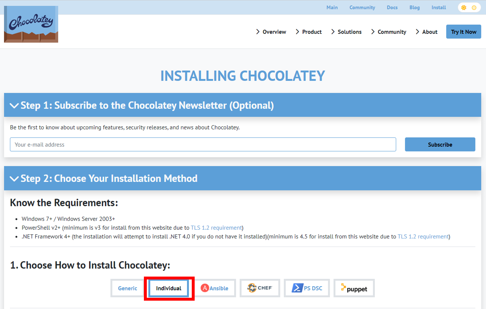

2. In your windows desktop, Run PowerShell as Administrator

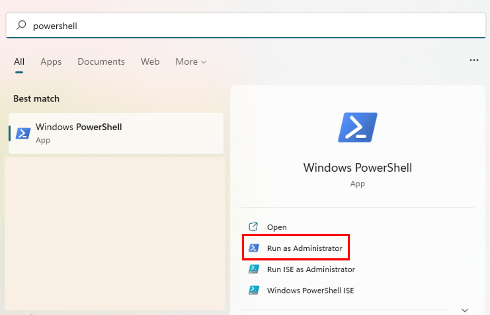

- Execute the following command:

```powershell
Set-ExecutionPolicy Bypass -Scope Process -Force; [System.Net.ServicePointManager]::SecurityProtocol = [System.Net.ServicePointManager]::SecurityProtocol -bor 3072; iex ((New-Object System.Net.WebClient).DownloadString('https://community.chocolatey.org/install.ps1'))
```

3. Once succesfully completed, type

```powershell
choco -?
```

- You will see the multiple options for running the Chocolatey Command Line Interfacer (CLI)

## Installation of Python using Chocolatey

1. To install the latest Python version, type:

```powershell
choco install python
```

- You will see an output like this. I recommend you to type the letter 'A' + enter to continue with the installation

```powershell
Chocolatey v1.1.0
Installing the following packages:
python
By installing, you accept licenses for the packages.
Progress: Downloading python3 3.10.6... 100%
Progress: Downloading python 3.10.6... 100%
python3 v3.10.6 [Approved]
python3 package files install completed. Performing other installation steps.
The package python3 wants to run 'chocolateyInstall.ps1'.
Note: If you don't run this script, the installation will fail.
Note: To confirm automatically next time, use '-y' or consider:
choco feature enable -n allowGlobalConfirmation
Do you want to run the script?([Y]es/[A]ll - yes to all/[N]o/[P]rint):
```

- After the installation finishes, you will see the following lines:

```powershell
 The install of python was successful.
  Software installed to 'C:\ProgramData\chocolatey\lib\python'

Chocolatey installed 1/1 packages.
 See the log for details (C:\ProgramData\chocolatey\logs\chocolatey.log).
```

2.  To confirm python was correctly installed, type:

```powershell
python --version
```

- The output will be:

```powershell
Python 3.10.6
```

## Installation of IntelliJ IDEA Community Edition

1. To install IntelliJ IDE Community Edition, let's type the following command:

```powershell
choco install intellijidea-community
```

- The output will be:

```powershell
Chocolatey v1.1.0
Installing the following packages:
intellijidea-community
By installing, you accept licenses for the packages.
Progress: Downloading intellijidea-community 2022.2.1... 100%

intellijidea-community v2022.2.1 [Approved]
intellijidea-community package files install completed. Performing other installation steps.
The package intellijidea-community wants to run 'chocolateyInstall.ps1'.
Note: If you don't run this script, the installation will fail.
Note: To confirm automatically next time, use '-y' or consider:
choco feature enable -n allowGlobalConfirmation
Do you want to run the script?([Y]es/[A]ll - yes to all/[N]o/[P]rint):
```

Type A and the enter key to perform the installation. It will take some minutes depending your internet speed.

After the installation finished succesfully, you will see this message:

```powershell
The install of intellijidea-community was successful.
Software installed to 'C:\Program Files\JetBrains\IntelliJ IDEA Community Edition 2022.2.1'
Chocolatey installed 1/1 packages.
See the log for details (C:\ProgramData\chocolatey\logs\chocolatey.log).
```

## Configuration and First Steps on the IntelliJ IDEA Community Edition

1. Start IntelliJ Idea in your windows computer.

   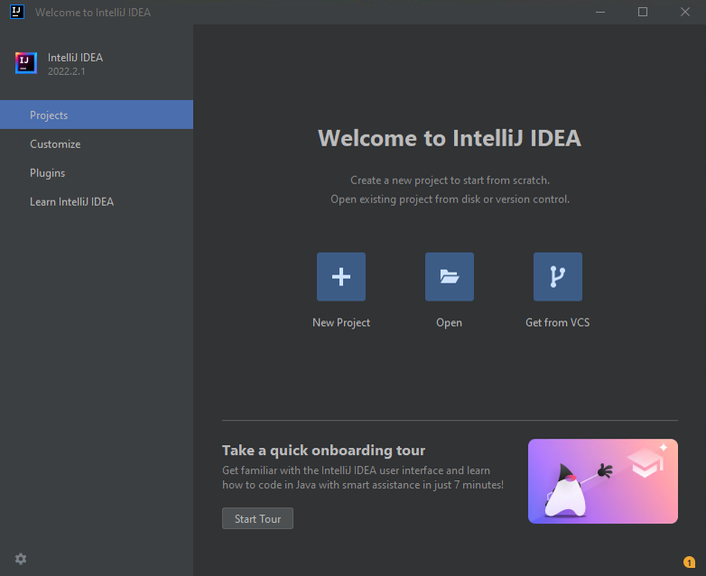

2. In the Welcome to IntelliJ IDEA page, select Plugins on the left
   side menu

- 2.1 Type the word 'python' without quotes in the search bar
- 2.2 Select the Install button in the Python Community Edition plugin
- 2.3 Return to the Projects section on the left side

  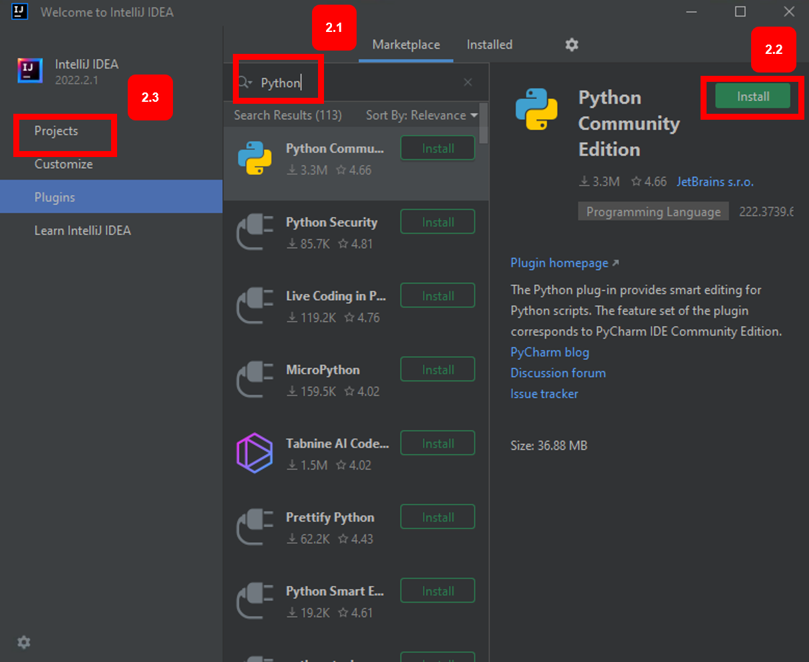

3. Select New Project

- 3.1 In the Name section, enter the name MSIT5214-Lab1
- 3.2 In Language, select Python
- 3.3 Select the Create button at the bottom of the screen

  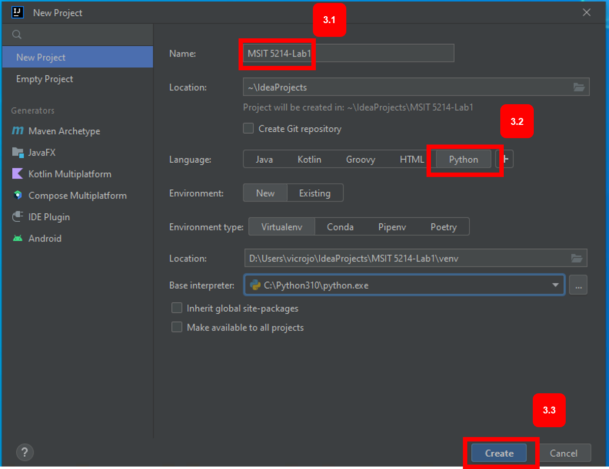

4. Add a new Python file to your Poject

- 4.1 and 4.2 Right Click the folder with the project name and select New > Python File

  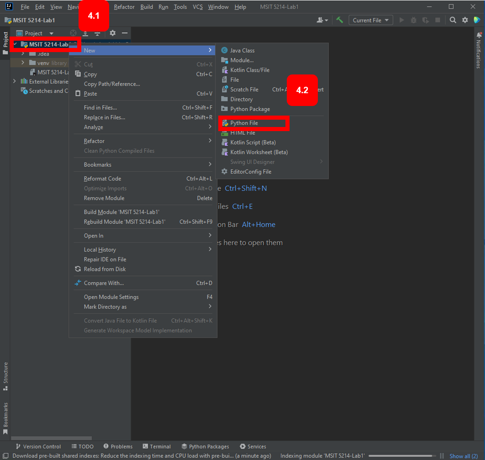

- 4.3 Enter the file name with the extension '.py' (unquotted) and hit the Enter key.

  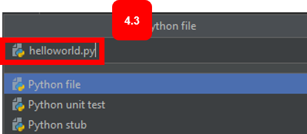

5. Add code to your new Python file

- 5.1 In the code editor, enter the sentence

```python
print("Hello UOP world!")
```

- 5.2 To run your code, simply select the play button, and see the output in the bottom of your IntelliJ IDE

  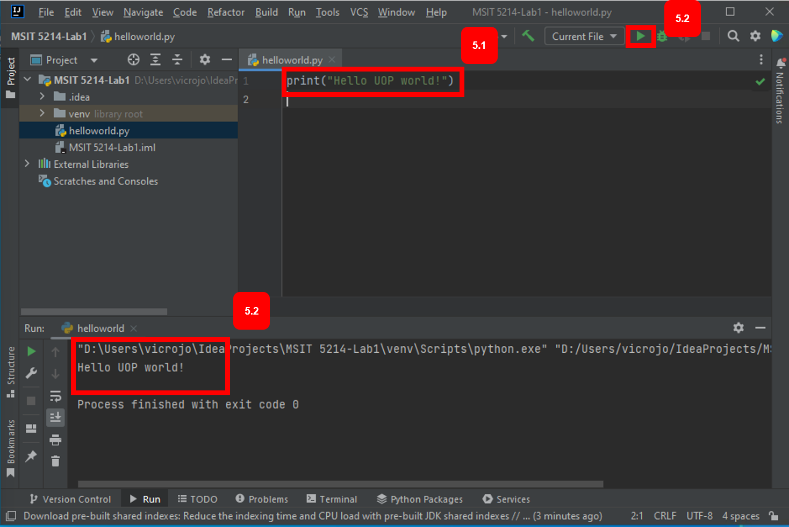

#### Congratulations!! You finished the IntelliJ IDE Setup Process.

## Installation of Visual Studio Code

. To install the Visual Studio Code IDE, type the following command:

```powershell
choco install vscode
```

- The output will be:

```powershell
Chocolatey v1.1.0
Installing the following packages:
vscode
By installing, you accept licenses for the packages.
Progress: Downloading vscode.install 1.70.2... 100%
Progress: Downloading DotNet4.5.2 4.5.2.20140902... 100%
Progress: Downloading vscode 1.70.2... 100%

DotNet4.5.2 v4.5.2.20140902 [Approved]
dotnet4.5.2 package files install completed. Performing other installation steps.
The package DotNet4.5.2 wants to run 'ChocolateyInstall.ps1'.
Note: If you don't run this script, the installation will fail.
Note: To confirm automatically next time, use '-y' or consider:
choco feature enable -n allowGlobalConfirmation
Do you want to run the script?([Y]es/[A]ll - yes to all/[N]o/[P]rint):
```

Type A and the enter key to perform the installation. It will take some minutes depending your internet speed.

After the installation finished succesfully, you will see this message:

```powershell
Microsoft .Net 4.5.2 Framework is already installed on your machine.
 The install of dotnet4.5.2 was successful.
  Software install location not explicitly set, it could be in package or
  default install location of installer.

vscode.install v1.70.2 [Approved]
vscode.install package files install completed. Performing other installation steps.
Merge Tasks: !runCode, desktopicon, quicklaunchicon, addcontextmenufiles, addcontextmenufolders, associatewithfiles, addtopath
Downloading vscode.install 64 bit
  from 'https://az764295.vo.msecnd.net/stable/e4503b30fc78200f846c62cf8091b76ff5547662/VSCodeSetup-x64-1.70.2.exe'
Progress: 100% - Completed download of D:\Users\vicrojo\AppData\Local\Temp\chocolatey\vscode.install\1.70.2\VSCodeSetup-x64-1.70.2.exe (79.04 MB).
Download of VSCodeSetup-x64-1.70.2.exe (79.04 MB) completed.
Hashes match.
Installing vscode.install...
vscode.install has been installed.
  vscode.install can be automatically uninstalled.
 The install of vscode.install was successful.
  Software installed to 'C:\Program Files\Microsoft VS Code\'

vscode v1.70.2 [Approved]
vscode package files install completed. Performing other installation steps.
 The install of vscode was successful.
  Software installed to 'C:\ProgramData\chocolatey\lib\vscode'

Chocolatey installed 3/3 packages.
 See the log for details (C:\ProgramData\chocolatey\logs\chocolatey.log).
```

## Configuration and First Steps on the Visual Studio Code IDE

1. Start VS Code on your windows computer

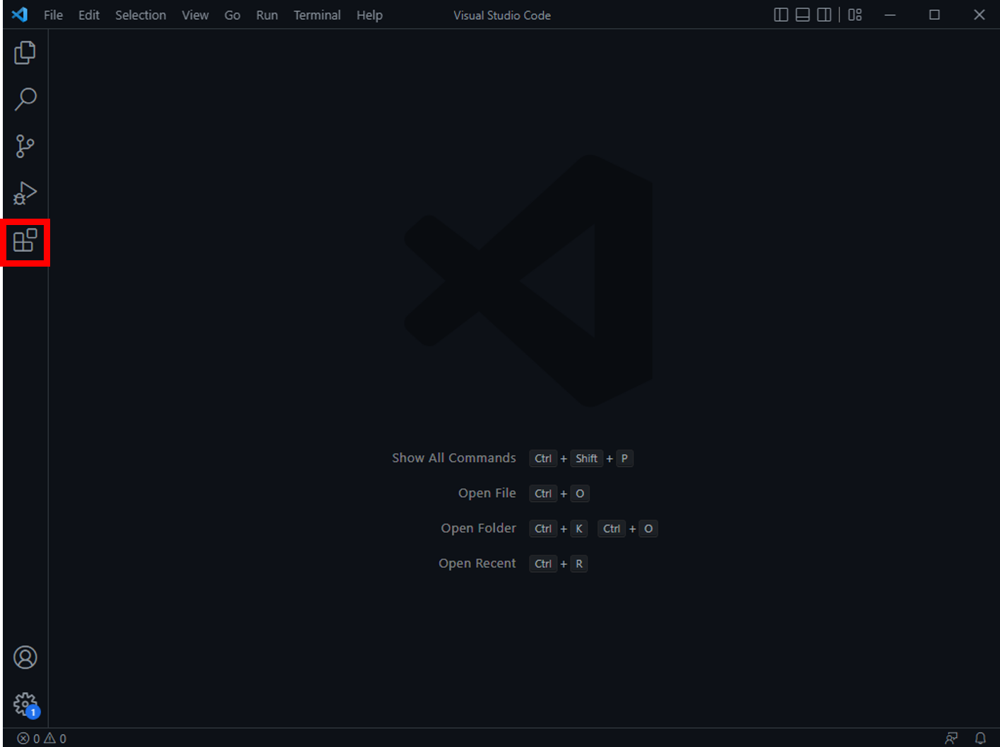

2. Install the Python Extension

- 2.1 Select the Extensions Icon Menu on the left side bar
- 2.2 In the search bar, type 'python' (without the quotes)
- 2.3 Select the IntelliSense extension and install it

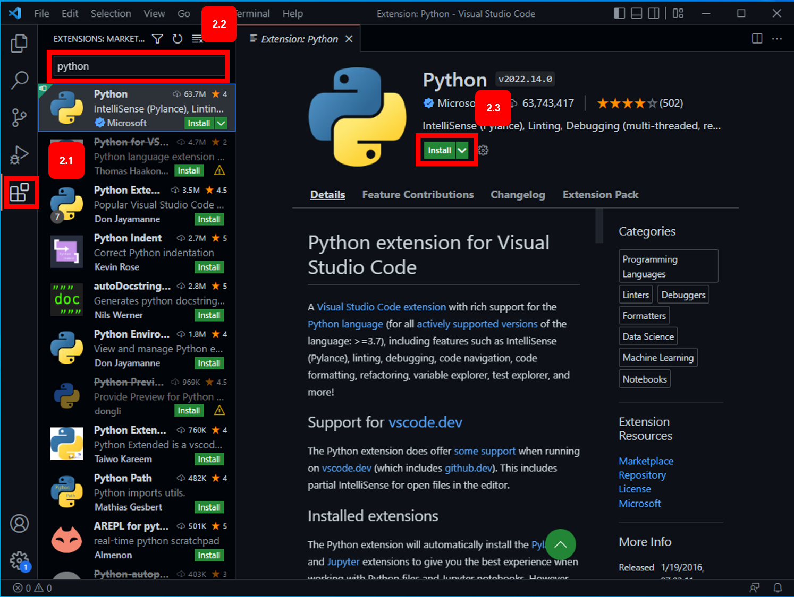

3. Create the new Project Folder

- 3.1 Select the menu File > Open Folder... and create a folder with the name MSIT5214-Lab1 and choose a folder in the location of your preference

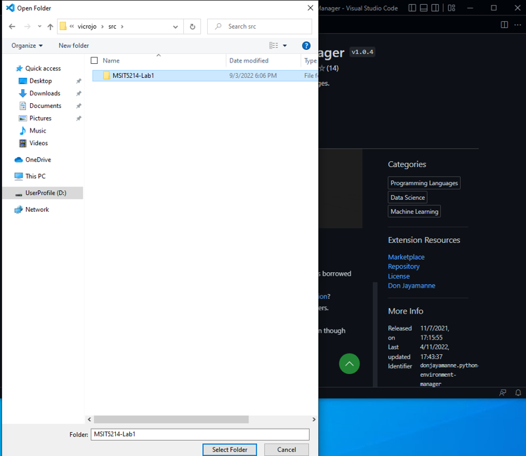

- 3.2 If you see an Authors' Trust windows, select the green button "Yes, I trust the authors"

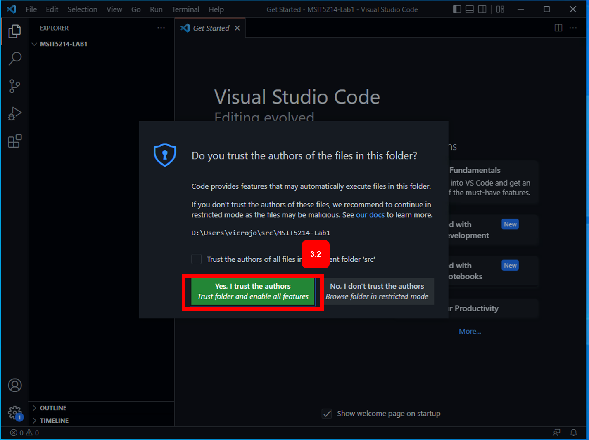

4. Add a new Python file to your Poject

- 4.1 Select the New File icon
- 4.2 Enter the name helloworld.py
- 4.3 In the code editor, enter the sentence

```python
print("Hello UOP world!")
```

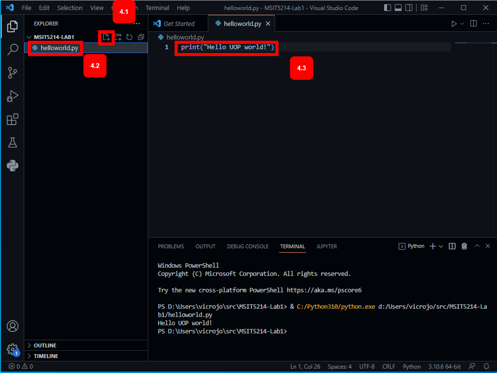

- 4.4 To run your code, simply select the play button > Run Python File

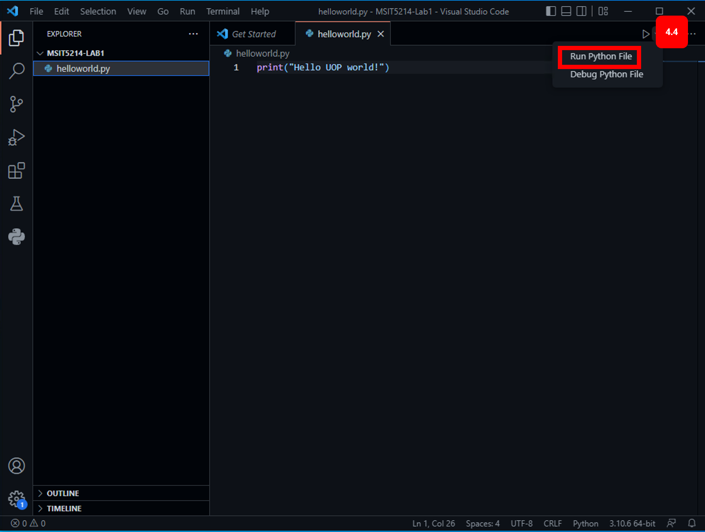

- 4.5 See the output in the Terminal section at the bottom of your screen

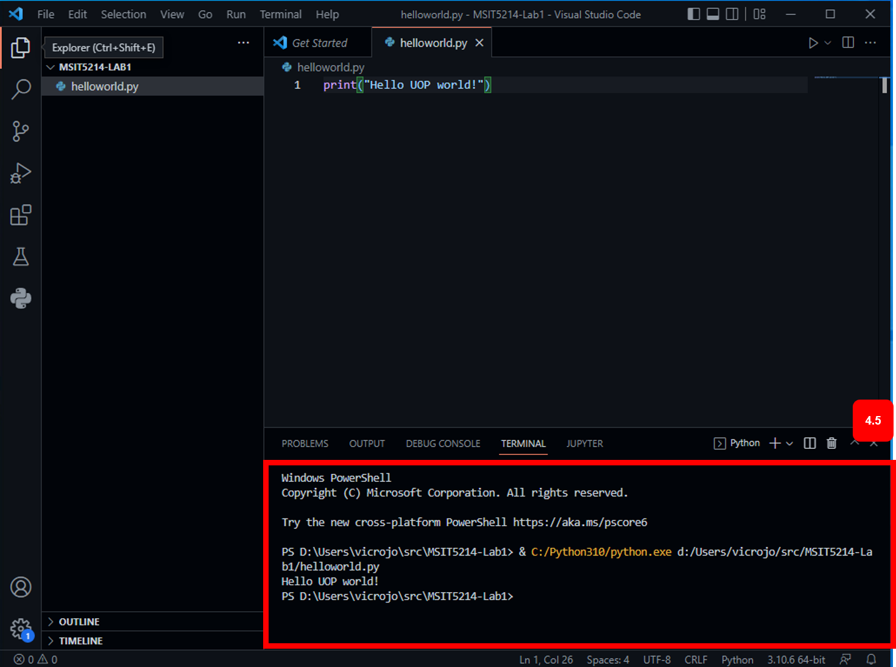

#### Congratulations!! You finished the Visual Studio IDE Setup Process.

Insights:

- Package managers ease the task of installing and updating the software required for the Lab

- IntelliJ generates the Python Virtual environments automatically for each project. This brings the benefit of provisioning ad-hoc environments for each project without the need to mix libraries that could overlap between each project. You can also specify the python interpreter version you need to use

- VSCode was easy to setup, and requires manual activation and configuration of virtual environments

#### Challenge:

How to do this wth VS Code?

- Using the [venv module](https://docs.python.org/3/library/venv.html)
- Using [conda or miniconda ](https://docs.conda.io/en/latest/) (another package manager for Python and Data Science)
